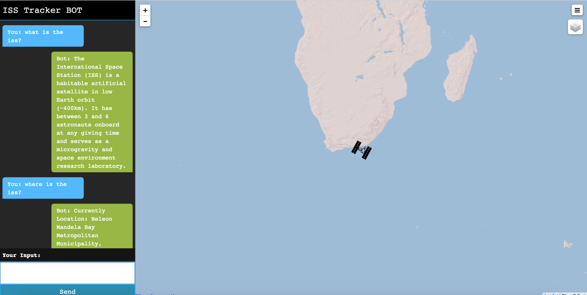

# CASIS Satellite Tracker

*Leer este documento en otros lenguajes: [한국어](README-ko.md), [English](README.md).*

(_Traducido por Watson Language Translator_)

En este patrón de código, vamos a crear un seguidor de satélites utilizando Node-RED e IBM Watson.
Se creará un flujo para conectar un Watson Assistant Chatbot con un nodo de node-red-contrib-satellites, así como una interfaz de usuario web y un nodo de mapa mundial.

Cuando el lector haya completado este patrón de código, entenderán cómo:

* Construir un flujo complejo y una interfaz de usuario web utilizando herramientas simples de Node-RED.
* Implementar un chatbot con Watson Assistant e incluirlo en una página web con Node-RED.
* Obtenga información de satélite para la Estación Espacial Internacional (ISS) y utilizarla en una aplicación web.


## Flujo

1. El usuario interactúa con la interfaz de usuario web para consultar el chatbotn "¿Dónde está la ISS?".
2. La interfaz de usuario web se comunica con Node-RED que se ejecuta en IBM Cloud.
3. La aplicación Node-RED que se ejecuta en la nube procesa la información y realiza las solicitudes HTTP.
4. La aplicación Node-RED se comunica con Watson Assistant para extraer intents y entidades.
5. Satélites que orbitan la Tierra envian información de posición que se transmita al módulo Node-RED.

## Módulos incluídos

* [Watson Assistant](https://www.ibm.com/watson/developercloud/conversation.html): Crear una chatbot con un programa que realiza una conversación a través de métodos auditivos o textuales.

## Tecnologías destacadas

* [Node-RED](https://nodered.org/): Node-RED es una herramienta de programación para conectar dispositivos de hardware, API y servicios en línea de formas nuevas e interesantes.
* [Inteligencia artificial (en inglés)](https://medium.com/ibm-data-science-experience): La inteligencia artificial se puede aplicar a espacios de soluciones dispares para ofrecer tecnologías disruptivas.
* [Node.js](https://nodejs.org/): Un entorno de tiempo de ejecución de JavaScript de código abierto para ejecutar código JavaScript del lado del servidor.

<!--
# Mirar el video (en inglés)
-->

# Steps

1. [Clonar el repositorio](#1-clonar-el-repositorio)
1. [Crear servicios de Watson con IBM Cloud](#2-crear-servicios-de-watson-con-ibm-cloud)
1. [Importar el espacio de trabajo de Watson Assistant](#3-importar-el-espacio-de-trabajo-de-watson-assistant)
1. [Obtenga las credenciales de Watson Assistant](#4-obtenga-las-credenciales-de-watson-assistant)
1. [Crear workspace de Node-RED](#5-crear-workspace-de-node-red)
1. [Obtener una API Key LocationIQ](#6-obtener-una-api-key-locationiq)
1. [Instalar nodos adicionales y realizar 7a o 7b](#7-instalar-nodos-adicionales)

    7a. [Construir el flujo Node-RED manualmente](doc/CreateFlowManually.md)

    7b. [Importar el flujo completado](#7b-importar-el-flujo-completado)
1. [Configure las credenciales](#8-configure-las-credenciales)

### 1. Clonar el repositorio

Clonar el repositorio `casis-satellite-tracker` localmente. En una terminal, ejecute:

```
$ git clone https://github.com/IBM/casis-satellite-tracker
```

### 2. Crear servicios de Watson con IBM Cloud

Cree el servicio [*Watson Assistant*](https://cloud.ibm.com/catalog/services/conversation) proporcionando un nombre de su elección y haciendo clic en `Crear`.

Una vez creados, verás las credenciales para *nombre de usuario* y *contraseña* o un IAM *apikey*, cualquiera de las cuales debe copiarse para ser utilizado más tarde. (Haga clic en `Mostrar` para exponerlos).


### 3. Importar el espacio de trabajo de Watson Assistant

Una vez que haya creado la instancia de Watson Assistant, haga clic en `Launch Tool` y haga clic en la ficha `Workspaces`. Importe el espacio de trabajo pulsando el icono de carga:


Haga clic en `Choose a file` y navegue hasta [`data/AssistantWorkspace/sat-tracker-workspace.json`](data/AssistantWorkspace/sat-tracker-workspace.json) en este repositorio. Haga clic en `Import`.

Obtenga el ID de espacio de trabajo haciendo clic en los tres puntos verticales en el separador `Workspaces`. Guarde esto para más tarde.

<p align="center">
  
</p>

### 4. Obtenga las credenciales de Watson Assistant

Las credenciales para el servicio IBM Cloud Watson Assistant pueden ser encontradas
seleccionando las opción ``Credenciales de servicio`` del servicio. Lo has guardado en el [paso #2](#2-crear-servicios-de-watson-con-ibm-cloud).

El `WORKSPACE_ID` para el workspace de Watson Assistant fue guardado en el
[paso #3](#3-importar-el-espacio-de-trabajo-de-watson-assistant).

### 5. Crear workspace de Node-RED

From the the [IBM Cloud Catalog](https://cloud.ibm.com/catalog/) navigate to `Platform` -> `Boilerplates` and choose [Node-RED Starter](https://cloud.ibm.com/catalog/starters/node-red-starter). Choose a name and click `Create`.

Una vez que la aplicación se haya desplegado, haga clic en `Visit App URL`


Siga las instrucciones para `Secure your Node-RED editor` y `Browse available IBM Cloud nodes`. Clic en `Finish` y luego clic en `Go to your Node-RED flow editor`.

### 6. Obtener una API Key LocationIQ

Necesitará una clave de API de [LocationIQ](https://locationiq.com/) para la función de geocodificación inversa en esta aplicación.

* Visite el [sitio web de LocationIQ](https://locationiq.com/) a desplácese hacia abajo hasta `Excited?! Get a developer token!`. Especifique su nombre y correo electrónico y siga las instrucciones para obtener un API Token. Guarde esto para más adelante, cuando configure el nodo `Credentials`.

### 7. Instalar nodos adicionales

Necesitará instalar los siguientes nodos adicionales:

* [node-red-contrib-credentials](https://flows.nodered.org/node/node-red-contrib-credentials)
* [node-red-contrib-web-worldmap](https://flows.nodered.org/node/node-red-contrib-web-worldmap)
* [node-red-contrib-satellites](https://flows.nodered.org/node/node-red-contrib-satellites)

Haga clic en el icono de menú en la parte superior derecha y luego en `Manage palette`.


Haga clic en la ficha `Install` y escriba el nombre del nodo que desea instalar en la barra de búsqueda y haga clic en, y haga clic en `install`.


### 7.a Construir el flujo Node-RED manualmente

Siga estas instrucciones para [construir manualmente el flujo Node-RED](doc/CreateFlowManually.md) (en inglés).

### 7.b Importar el flujo completado

Caminaremos a través de los pasos para crear el flujo Node-RED, pero puede importar el flujo completado. Copie el flujo en el portapapeles de la máquina navegando hasta `data/NodeRED/`.

Un flujo se puede mover a un portapapeles de Mac OS con:
```
$ pbcopy < flow.json
```

En Windows use:
```
$ cat flow.json | clip
```

En Linux use:
```
$ cat flow.json | xclip
```

Una vez que el `flow.json` está en el portapapeles, haga clic en el icono de menú de la parte superior derecha y seleccione `Import` -> `Clipboard`. Pegue el contenido del portapapeles y haga clic en `Import`.


### 8. Configure las credenciales

* Haga clic en el nodo `ISS Assistant` y llene el `username` y `password` o la `API Key`, en función de la cual formaba parte de las credenciales de Watson Assistant ([Obtenga las credenciales de Watson Assistant](#4-obtenga-las-credenciales-de-watson-assistant)).

* Haga clic en el nodo `Credentials` y coloque la clave de API locationIQ de [Obtener una API Key LocationIQ](#6-obtener-una-api-key-locationiq) in the field `private`.

> NOTA: Después de cualquier cambio, tendrá que hacer clic en el botón `Deploy` para que se vean.

# Ejemplo de salida

Utilice la aplicación en ejecución yendo a `<Node-RED_URL>/bot`



# Resolución de problemas

# Links

* [Node-RED satellite module](https://flows.nodered.org/node/node-red-contrib-satellites)
* [Node-RED World Map](https://flows.nodered.org/node/node-red-contrib-web-worldmap)
* [IBM Bot Asset Exchange](https://developer.ibm.com/code/exchanges/bots/)

# Obtenga más información

* **Patrones de código de Inteligencia Artificial**: ¿Disfrutó de este patrón de código? Echa un vistazo a otros [Patrones de Código AI](https://developer.ibm.com/code/technologies/artificial-intelligence/).
* **Playlist de Patrón de Código de Datos y AI:**: Marcar nuestra [lista de reproducción](https://www.youtube.com/playlist?list=PLzUbsvIyrNfknNewObx5N7uGZ5FKH0Fde) con todos los vídeos de patrónes de código.
* **Con Watson**: ¿Desea llevar tu aplicación con Watson al siguiente nivel? ¿Está buscando utilizar los activos de Brand de Watson? [Únase al programa Con Watson](https://www.ibm.com/watson/with-watson/) para aprovechar la marca exclusiva, marketing y recursos tecnológicos para amplificar y acelerar la solución comercial integrada de Watson.

# Licencia
[Apache 2.0](LICENSE)
