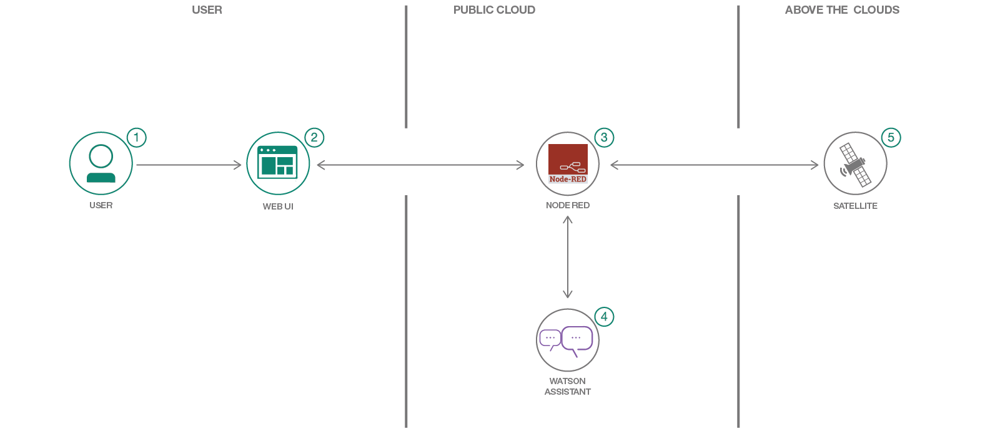

[](https://travis-ci.org/IBM/casis-satellite-tracker)
# CASIS Satellite Tracker
*다른 언어로 보기: [English](README.md).*

이 코드 패턴에서는 Node-RED와 IBM Watson을 사용하여 위성 추적기를 구축 할 것입니다. Watson Assistant Chatbot을 node-red-contrib-satellites 노드뿐만 아니라 웹 UI 및 월드 맵 노드에 연결하기 위한 플로우가 생성됩니다.


이 코드 패턴을 진행하시면, 다음의 내용을 배울 수 있습니다.

* 간단한 Node-RED 도구를 사용하여 복잡한 흐름과 웹 UI를 구축하는 방법을 배울 수 있습니다.
* Watson Assistant를 사용하여 챗봇을 구현하고 Node-RED가 있는 웹 페이지에 포함할 수 있는 방법을 배울 수 있습니다.
* 국제 우주 정거장 (ISS)에 대한 위성 정보를 얻고 웹앱에서 사용하는 방법을 배울 수 있습니다.



## Flow

1. 사용자가 웹 UI와 상호 작용하여 챗봇에 "ISS는 어디에 있습니까?"라고 문의합니다.
2. 웹 UI는 IBM Cloud에서 실행중인 Node-RED와 통신합니다.
3. 클라우드에서 실행되는 Node-RED 앱은 정보를 처리하고 HTTP 요청을 수행합니다.
4. Node-RED 앱은 Watson Assistant와 통신하여 인텐트와 엔티티를 추출합니다.
5. 지구를 공전하는 위성은 Node-RED 모듈로 스트리밍되는 위치 정보를 보냅니다.

## Included components

* [Watson Assistant](https://www.ibm.com/watson/developercloud/conversation.html): 청각 또는 텍스트 방법을 통해 대화를 진행하는 챗봇을 만들 수 있습니다.

## Featured technologies

* [Node-RED](https://nodered.org/): Node-RED는 새롭고 흥미로운 방식으로 하드웨어 장치, API 및 온라인 서비스를 함께 연결하는 프로그래밍 도구입니다.
* [Artificial Intelligence](https://medium.com/ibm-data-science-experience): Artificial intelligence can be applied to disparate solution spaces to deliver disruptive technologies.
* [Node.js](https://nodejs.org/): 서버 측 JavaScript 코드를 실행하기위한 오픈 소스 JavaScript 런타임 환경.

<!--
# Watch the Video
-->

# Steps

## Run locally

1. [Git 저장소 복제하기](#1-git-저장소-복제하기)
1. [IBM 클라우드에 왓슨 서비스 생성하기](#2-ibm-클라우드에-왓슨-서비스-생성하기)
1. [Watson Assistant 워크스페이스 불러오기](#3-watson-assistant-워크스페이스-불러오기)
1. [Watson Assistant 신임 정보 가져오기](#4-watson-assistant-신임-정보-가져오기)
1. [Node-Red 워크스페이스 생성하기](#5-node-red-워크스페이스-생성하기)
1. [LocationIQ API 키 가져오기](#6-locationiq-api-키-가져오기)
1. [7a 또는 7b를 수행하기 위한 추가 노드 설치하기](#7-추가-노드-설치하기)

    7a. [Node-Red 플로우 직접 작성하기](#7a-node-red-플로우-직접-작성하기)

    7b. [완성된 플로우 가져오기](#7b-완성된-플로우-가져오기)
1. [신임 정보 설정하기](#8-신임-정보-설정하기)

### 1. Git 저장소 복제하기

`casis-satellite-tracker`를 로컬에 복제합니다. 터미널에서 다음을 실행합니다.

```
$ git clone https://github.com/IBM/casis-satellite-tracker
```

### 2. IBM 클라우드에 왓슨 서비스 생성하기

원하는 서비스 이름을 넣은 후 `Create`버튼을 눌러서 [*Watson Assistant*](https://console.ng.bluemix.net/catalog/services/conversation) 서비스를 생성합니다.

서비스가 생성되면 *유저이름* 과 *패스워드* 로 구성된 신임 정보 혹은 IAM *apikey* 신임 정보를 확인할 수 있습니다. 이중 하나를 나중에 사용하기 위해서 복사합니다.(별표로 된 부분을 확인을 위해 `Show`를 누릅니다).


### 3. Watson Assistant 워크스페이스 불러오기

Watson Assistant 인스턴스를 생성하고 나면 `Launch Tool` 버튼을 클릭 후, `Workspaces` 탭을 클릭합니다. upload 아이콘을 클릭해서 작업 영역을 가져옵니다.:


`Choose a file`을 클릭해서 저장소에 존재하는  [`data/AssistantWorkspace/sat-tracker-workspace.json`](data/AssistantWorkspace/sat-tracker-workspace.json) 을 선택합니다. `Import` 를 클릭합니다.

`Workspaces` 탭에 있는 3개의 수직점을 클릭하여 ``Workspace ID`` 값을 가져옵니다. 나중에 사용을 위해서 저장해둡니다.

<p align="center">
  
</p>

### 4. Watson Assistant 신임 정보 가져오기

IBM Cloud Watson Assistant 서비스에 대한 신임 정보는 해당 서비스에서 ``Service Credentials`` 옵션을 선택해서 찾을 수 있습니다. 관련 내용은 이미 [step #2](#2-ibm-클라우드에-왓슨-서비스-생성하기) 에서 진행하였습니다.

Watson Assistant 워크스페이스의 `WORKSPACE_ID` 는 [step #3](#3-watson-assistant-워크스페이스-불러오기) 에서 진행하였습니다.

### 5. Node-Red 워크스페이스 생성하기

[IBM Cloud Catalog](https://console.bluemix.net/catalog/)에서 `Platform` -> `Boilerplates` 를 조회 후 [Node-RED Starter](https://console.bluemix.net/catalog/starters/node-red-starter)를 선택합니다. 앱 이름을 선택하고 `Create` 버튼을 누릅니다.

앱 배치가 완료되면 `Visit App URL`을 클릭합니다.


`Secure your Node-RED editor` 와 `Browse available IBM Cloud nodes` 가이드에 맞춰서 진행합니다. `Finish` 버튼을 클릭 후 `Go to your Node-RED flow editor` 버튼을 클릭합니다.

### 6. LocationIQ API 키 가져오기

현재 앱에서 reverse geocoding 기능을 사용하기 위해서는 [LocationIQ](https://locationiq.com/)에서 API 키가 필요합니다.

* [LocationIQ website](https://locationiq.com/)에서 아래로 스크롤해서 `Excited?! Get a developer token!`를 찾습니다. 이름과 이메일을 입력하고 지침에 따라 API 토큰을 받으십시오. 차후 `credentials` 노드에서 설정하기 위해서 API 토큰을 저장합니다.

### 7. 추가 노드 설치하기

다음 추가 노드를 Node-RED에서 설치해야합니다.

* [node-red-contrib-credentials](https://flows.nodered.org/node/node-red-contrib-credentials)
* [node-red-contrib-web-worldmap](https://flows.nodered.org/node/node-red-contrib-web-worldmap)
* [node-red-contrib-satellites](https://flows.nodered.org/node/node-red-contrib-satellites)

우측 상단에 메뉴 아이콘을 클릭한 후에 `Manage palette` 메뉴를 클릭합니다.


`Install tab`을 클릭하고 검색 창에 설치할 노드의 이름을 입력 후에 `install`을 클릭합니다.


### 7.a Node-Red 플로우 직접 작성하기

다음 지침을 따라서 Node-RED 플로우를 빌드합니다 [Node-RED 플로우 직접 작성하기](doc/CreateFlowManually.md).

### 7.b 완성된 플로우 가져오기

[step #7.a](#7a-node-red-플로우-직접-작성하기)에서 Node-RED 플로우를 빌드하는 단계를 거치지만 완성된 플로우를 가져올 수 있습니다. `data/NodeRED/`에서 완성된 플로우를 찾아서 클립보드에 복사합니다.

플로우는 아래 명령을 사용하여 Mac OS 클립 보드로 가져올 수 있습니다.:
```
$ pbcopy < flow.json
```

윈도우에서의 명령어:
```
$ cat flow.json | clip
```

리눅스에서의 명령어:
```
$ cat flow.json | xclip
```

`flow.json` 을 클립 보드로 가져온 후, 우측 상단 메뉴에서 `Import` -> `Clipboard` 메뉴를 선택합니다. 클립보드의 내용을 붙여놓고 `Import` 버튼을 클릭합니다.


### 8. 신임 정보 설정하기

* `ISS Assistant` 노드를 클릭해서 [Watson Assistant 신임 정보 가져오기](#4-watson-assistant-신임-정보-가져오기) 단계를 통해서 저장해둔 `username` 과 `password` 혹은 `API Key` 정보를 해당 노드에 설정합니다.

* `Credentials` 노드를 선택 후 [LocationIQ API 키 가져오기](#6-locationiq-api-키-가져오기) 단계를 통해서 저장해둔 LocationIQ API 키 값을 `private` 필드에 설정합니다.

> NOTE: 변경 후에는 `Deploy` 버튼을 클릭하여 해당 플로우를 라이브 시켜야합니다.


# Sample output


# Troubleshooting

# Links

* [Node-RED satellite module](https://flows.nodered.org/node/node-red-contrib-satellites)
* [Node-RED World Map](https://flows.nodered.org/node/node-red-contrib-web-worldmap)
* [IBM Bot Asset Exchange](https://developer.ibm.com/code/exchanges/bots/)

# Learn more

* **Artificial Intelligence Code Patterns**: 이 코드 패턴이 도움이 되셨나요? 다른 [AI 코드 패턴](https://developer.ibm.com/code/technologies/artificial-intelligence/)도 확인해보세요.
* **AI and Data Code Pattern Playlist**: 다른 코드 패턴 영상과 함께 [플레이리스트](https://www.youtube.com/playlist?list=PLzUbsvIyrNfknNewObx5N7uGZ5FKH0Fde)를 즐겨찾기하세요.
* **With Watson**: 애플리케이션을 다음 단계로 확장하고 싶으십니까? Watson 브랜드 에셋을 찾고 계신가요? [With Watson 프로그램에 가입하셔서 ](https://www.ibm.com/watson/with-watson/) 귀하에게만 제공되는 브랜드, 마케팅 및 기술 리소스를 활용하여 Watson 임베디드 상용 솔루션을 강화하고 가속화하십시오.

# License
[Apache 2.0](LICENSE)
