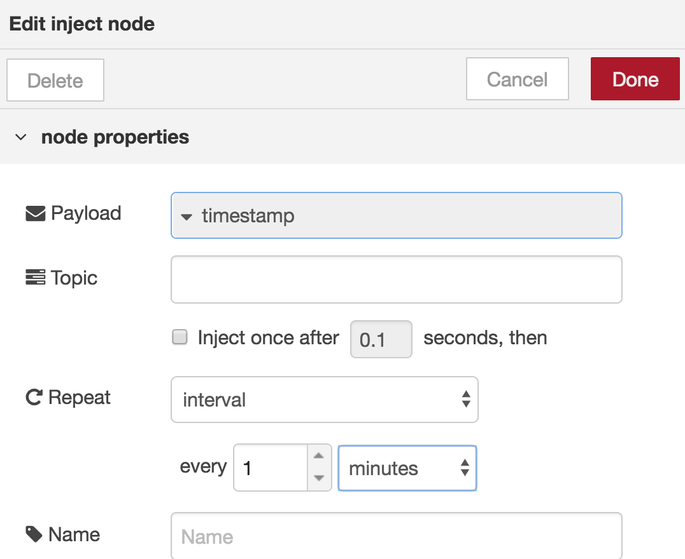
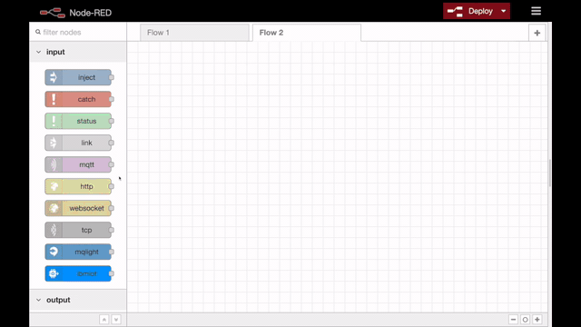

# Build the Node-RED Flow Manually

In order to build the Node-RED flow for the CASIS satellite tracker, you will use the flow editor to add and connect nodes, and put configuration information and code in the appropriate node.

> NOTE: You can find nodes in the `filter nodes` search box in the upper left of the flow editor.

  

#### Create the HTML UI

* In your Node-RED flow editor, drag-and-drop nodes for `HTTP input`, 2 `template` nodes, and `HTTP response` and wire them together.

* Add the [Chat Page JS](../data/nodeContent/ChatPageJS.js) code to the first template node and the [HTML](../data/nodeContent/index.html) code to the second template node and name them accordingly.

* Details are available in the [Create HTML UI video](https://ibm.box.com/s/bqxloubya8slsuh358jtyq1bu4toamx7)

#### Create the World Map UI

* In the Node-RED flow editor, drag-and-drop 2 `inject` nodes, 3 `function` nodes, a `satellite` node and a `worldmap-tracks` node.

* Wire them up:

* Double-click both `inject` nodes (labeled `timestamp`) and tick the checkbox for ` Inject once after 0.1 seconds, then`. On the lower one, which feeds the `satellite` node, choose `Repeat` -> `interval` and set the interval to every `1` `minutes`.

  

* Double-click the `satellite` node and you should see `Sat. Type` -> `Space Stations` and `Satellite` -> `ISS (ZARYA)`. Click `Done`.

* Double-click the top function node (after the timestamp) and add the code for [add map layer](../data/nodeContent/addMapLayer.js). Name it `add map layer`.

* Double-click the function node after the ISS (ZARYA) satellite node and add the code for [ISS to Map](../data/nodeContent/ISStoMap.js). Name it `ISS to map`.

* Double-click the last function node, after `ISS to map`, and add the code for [move and zoom](..data/nodeContent/moveAndZoom.js). Name it `move and zoom`.

* Details are available in the [Create Worldmap UI video](https://ibm.box.com/s/glu64qw4wfic9im642vcapgwwzn2dcvg)

