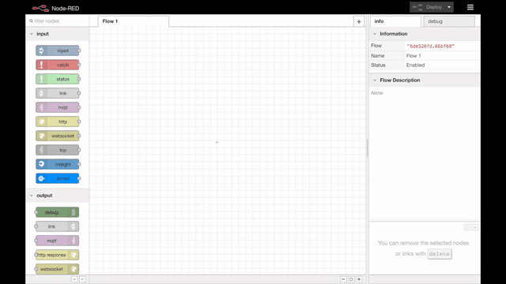

# Build the Node-RED Flow Manually

In order to build the Node-RED flow for the CASIS satellite tracker, you will use the flow editor to add and connect nodes, and put configuration information and code in the appropriate node.

#### Create the HTML UI

* In your Node-RED flow editor, drag-and-drop nodes for `HTTP input`, 2 `template` nodes, and `HTTP response` and wire them together.

* Add the [Chat Page JS](../data/nodeContent/ChatPageJS.js) code to the first template node and the [HTML](../data/nodeContent/index.html) code to the second template node and name them accordingly.

* Details are available in the [Create HTML UI video](https://ibm.box.com/s/bqxloubya8slsuh358jtyq1bu4toamx7)

