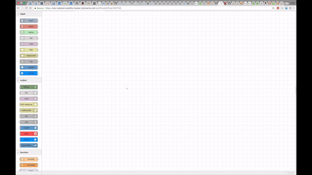
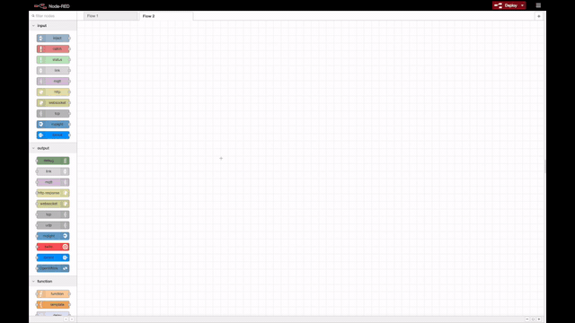
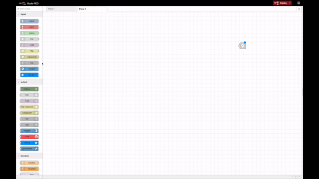
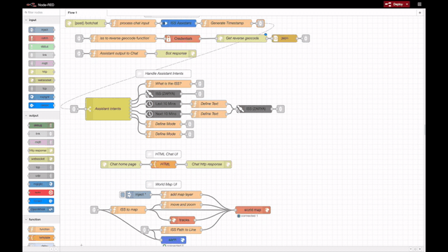

# Build the Node-RED Flow Manually
*다른 언어로 보기: [English](CreateFlowManually.md).*

CASIS 위성 추적기에 대한 Node-RED 흐름을 작성하려면 흐름 편집기를 사용하여 노드를 추가 및 연결하고 해당 노드에 구성 정보 및 코드를 넣으십시오.

> NOTE: 다음 명령을 사용하여 파일 내용을 운영 체제 클립 보드로 이동할 수 있습니다.:

 `pbcopy < myfile` Mac 환경,

 `cat myfile |clip` Windows 환경, 혹은

 `cat myfile| xclip` Linux 환경.

> NOTE: 흐름 편집기 왼쪽 위편에 `filter nodes` 검색창에서 노드를 찾을 수 있습니다.

<p align="left">
  
</p>

> NOTE:  한 화면에 모든 흐름을 표시하고 여러 노드를 연결하기 위해서 `link` 노드를 추가합니다. 우선 노드를 추가하고 마지막에 노드를 연결합니다.

### Watson Assistant Chat API 작성하기

* 다음 노드를 순서대로 배치후 연속으로 연결하십시오. 다음 3 개 그룹은 3 개의 행을 나타냅니다.:

```
http in
function
assistant
function
link out

link in
function
credentials
http request
json
link out

link in
function
http response
```

흐름은 다음과 같이 나타나야 합니다.:


* 첫 번째 노드인 `http in` 을 더블클릭 후 Method를 `POST`로 바꾸고 URL은 `/botchat`로 작성합니다.

* `function` 노드를 더블클릭 후 , 노드 이름을 `Process chat input`로 바꾸고 [processChatInput.js](../data/NodeRED/Functions/processChatInput.js) 코드를 복사해서 붙여넣습니다.

* `Assistant` 노드를 더블클릭 후 , 노드 이름을 'ISS Assistant'로 바꿉니다. `username` 과 `password`또는 IAM `apikey` 값을 추가하고, 이전 Watson Assistant 서비스 생성시 저장해둔 `Workspace ID` 값을 추가합니다.

* 첫번째 행의 마지막 `function` 노드를 더블클릭 후 노드 이름을 `Generate Timestamp` 바꾸고 [generateTimestamp.js](../data/NodeRED/Function/generateTimestamp.js) 코드를 복사해서 붙여넣습니다.

* 두번째 행의 `function` 노드를 더블클릭 후 노드 이름을 `ISS to reverse geocode function`으로 이름을 변경하고, [ISStoReverseGeocode.js](../data/NodeRED/Functions/ISStoReverseGeocode.js) 코드를 복사해서 붙여넣습니다.

* `credentials` 노드를 더블클릭 합니다. `Values` 박스 아래 `+add` 를 클하고 locationIQ API 키를 `private` 박스에 넣은 후 `to` 박스를  msg.`API_key` 로 변경합니다.

* `http request` 노드를 더블클릭 후 이름을 `GET reverse geocode`로 변경합니다. URL 박스에  [getReverseGeocode](../data/NodeRED/Functions/getReverseGeocode) URL 정보를 복사해서 붙여넣습니다.

* `json` 노드는 변경 할 필요가 없습니다.

* 세번째 행의 `function` 노드를 더블클릭 후 노드 이름을 `Assistant output to chat`로 변경합니다. [assistantOutputToChat.js](../data/NodeRED/Functions/assistantOutputToChat.js) 코드를 복사해서 붙여넣습니다.

* 마지막으로 `http response` 노드를 더블 클릭 후 노드 이름을 `Bot response`로 변경합니다. 상태 코드를 `200`으로 변경합니다.

* [작업 영상](https://ibm.box.com/s/po139lfl6yp7l58txe03y63ijz0bucbh)



### Handle Assistant Intents 작성하기

* 여기서는 다음을 구축 할 것입니다.:


* 아래의 노드를 순서대로 배치한 뒤 연결합니다.

```
link node
switch node

in parallel:
function node
satellite node
time array
time array
function
function

from each time array:
function
function

from both functions:
satellite

link node
```

* `switch` 노드를 열어서 노드 이름을 `Assistant Intents`로 변경하고 `Property` 값에 `assistant.intents[0].intent`를 추가합니다(`msg.` 뒤). 총 6개의 intent를 사용할 예정이므로 `+add` 버틀을 사용해서 5개를 추가합니다. 해당 intent의 이름을 아래와 같이 변경합니다.: `what`,`where`,`where-historical`,`where-future`, `mode-2d`, 그리고 `mode-3d`.

* 두번째 행의 가장 위 function 노드를 열어서 노드 이름을 `What is the ISS?`로 변경한 후  [whatIsTheISS.js](../data/NodeRED/Functions/whatIsTheISS.js) 코드를 복사하여 붙여넣습니다.

* Satellite 노드는 이미 `Sat. Type` 은 `Space Stations`로 그리고 Satellite값은 `ISS(ZARYA)`로 설정되어 있습니다.

* Satellite Time Array 노드를 열어서 `+/- Minus` 를 `10` 분으로 변경하고, Samples 을 `20`으로 변경 후, 노드 이름을 `Last 10 mins`으로 변경합니다.

* 두번째 Satellite Time Array 노드를 `+/- Minus` 를 `0` 분, Samples 을 `20`, 그리고 노드 이름을 `Next 10 mins` 설정합니다.

* Function 노드를 열어서, 노드 이름을 `Define Mode`로 변경하고, [defineMode.js](../data/NodeRED/Functions/defineMode.js) 코드를 복사하여 붙여넣습니다.

* 아래 Function 노드를 열어서, 노드 이름을 `Define Mode`로 변경하고, [defineMode.js](../data/NodeRED/Functions/defineMode.js) 코드를 복사하여 붙여넣습니다. 그리고 코드에서 `2d` 를 `3d`로 변경합니다.

* Satellite Time array 뒤에 있는 두개의 Function 노드들은 노드이름을 `Define Text`라고 설정합니다.  [defineText.js](../data/NodeRED/Functions/defineText.js) 코드를 복사하여 붙여넣고 아래의 노드의 코드에서 `Last` 를 `Next` 로 변경합니다.

* 마지막 Satellite 노드는 첫 Satellite 노드와 마찬가지로 Satellite값이 `ISS(ZARYA)`로 설정되어 있습니다.

* [작업 영상](https://ibm.box.com/s/4rny7vlf1o7q3bfdb5zs6trllfw2mzks)



### HTML Chat UI 작성하기

* Node-RED 흐름 편집기에서, `HTTP input`, `template`, 그리고 `HTTP response` 노드를 끌어서 놓고 서로 연결합니다.

* 첫번째 `http in` 노드를 더블클릭 후 Method를 `GET` 으로 그리고 URL 은 `/bot`으로 설정합니다. 노드이름을 `Chat home page`로 설정합니다.

* [chat-ui.html](../data/NodeRED/HTML/chat-ui.html) 코드를 template node에 추가하고 노드 이름을 `HTML`로 설정합니다.

* http response 노드의 이름을 `Chat http response`로 설정합니다.

* [작업 영상](https://ibm.box.com/s/aq1q42g1d6oib6hwffcymnyw4uf070um)



### World Map UI 작성하기

* Node-RED 흐름 편집기에서, `link` 노드 2개, `inject` 노드 1개, `function` 노드 4개, `worldmap` 노드 한개, `earth` 노드 한개, 그리고  `worldmap-tracks` 한개를 끌어서 놓습니다.

* 서로를 연결합니다:


* `inject` 노드를 더블클릭 한 후 `Inject once after 0.1 seconds` 체크박스를 체크합니다.

* 가장 위에 있는 function 노드(timestamp 다음에 있는 노드)를 클릭하고, [add map layer](../data/NodeRED/Functions/addMapLayer.js) 코드를 복사하여 붙여넣습니다. 노드 이름을 `add map layer`로 설정합니다.

* Link 노드 다음에 있는 function 노드를 더블클릭 후, [ISS to Map](../data/NodeRED/Functions/ISStoMap.js) 코드를 복사하여 붙여넣습니다. 노드 이름을 `ISS to map`으로 설정합니다.

* `ISS to map` 노드 다음에 있는 function 노드를 더블 클릭 후 [move and zoom](..data/NodeRED/Functions/moveAndZoom.js) 코드를 복사하여 붙여넣습니다. 노드 이름을 `move and zoom`으로 설정합니다.

* `tracks` 노드 아래 그리고 `earth` 노드 위에 있는 function 노드를 더블 클릭 후, 노드 이름을 `ISS Path to Line`으로 변경하고,  [ISSPathToLine.js](..data/NodeRED/Functions/ISSPathToLine.js) 코드를 복사하여 붙여넣습니다.

* `worldmap`, `tracks`, 그리고 `earth` 노드는 다른 설정이 필요하지 않습니다.

* [작업 영상](https://ibm.box.com/s/6r04mju2xrgcfmoocyjgn3lwq7puyq2c)


### Link 노드들 연결하기

링크 노드는 연결된 노드에 대해 이름이 붙여지는데 노드에 들어오고 나가는지 여부에 따라서 `IN` 또는 `OUT` 노드로 정해집니다.
링크 노드를 연결하기 위해서는 더블 클릭 후 연결 될 노드를 선택하면 됩니다.
예를 들자면, `Generate Timestamp OUT` 가 `Assistant Intents IN` 로 연결됩니다.:


  
  

* `iss to reverse geocode IN` 노드를 `ISS Location OUT` 노드로 연결합니다.:


* `json OUT` 노드를 `Assistant output to Chat IN` 노드로 연결합니다.:


*  `What is ISS OUT`, `ISS 2 OUT`, `Define Mode 2d OUT`, 그리고 `Define Mode 3d OUT` 노드를 `Assistant output to Chat IN` 노드로 연결합니다.:


* `ISS Location OUT` 노드를 `ss to reverse geocode IN` 와 `ISS to Map IN` 노드로 연결합니다.:


* `ISS 2 OUT` 를 `ISS to Map IN` 와 `ISS Path to Line IN` 노드로 연결합니다. (`Assistant output to Chat IN` 노드는 이미 연결되어 있습니다.):


* [작업 영상](https://ibm.box.com/s/3thnc37nsam9dkj8aapweiz4xu4wp1ih)



### App에 배포하기

`Deploy` 버튼을 클릭합니다.


