# Build the Node-RED Flow Manually

In order to build the Node-RED flow for the CASIS satellite tracker, you will use the flow editor to add and connect nodes, and put configuration information and code in the appropriate node.

> NOTE: You can move the contents of a file to your Operating System clipboard with:

 `pbcopy < myfile` on MacOS,

 `cat myfile |clip` on Windows, or

 `cat myfile| xclip` on Linux.

> NOTE: You can find nodes in the `filter nodes` search box in the upper left of the flow editor.

<p align="left">
  
</p>

> NOTE:  We'll add `link` nodes to allow them to fit on one screen, and to connect multiple nodes via branching. We'll add the nodes first, then connect them at the the end.

### Create the Watson Assistant Chat API

* Grab the following nodes in order, and wire them up in a row. The following 3 groups represent 3 rows:

```
http in
function
assistant
function
link out

link in
function
credentials
http request
json
link out

link in
function
http response
```

The flow should look like this:

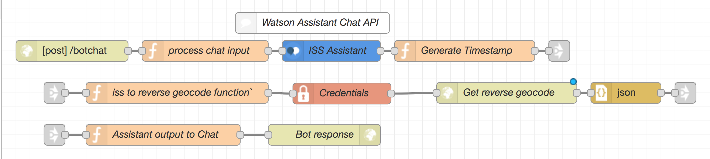

* Double-click the first node, `http in` and change the Method to `POST` and the URL to `/botchat`

* Double-click the next `function` node, change the name to `Process chat input` and cut-n-paste the [processChatInput.js](../data/NodeRED/Functions/processChatInput.js) code.

* Double-click the `Assistant` node, and name it 'ISS Assistant'. Add the `username` and `password`, or the IAM `apikey`, and the `Workspace ID`  that you saved earlier when you created the Watson Assistant service.

* Double-click the final `function` node in the first row, name it `Generate Timestamp`, and cut-n-paste the [generateTimestamp.js](../data/NodeRED/Function/generateTimestamp.js) code.

* Start the second row by double-clicking on the first `function` node in that row and name it `ISS to reverse geocode function`, and paste the [ISStoReverseGeocode.js](../data/NodeRED/Functions/ISStoReverseGeocode.js) code.

* Double click the `credentials` node. Click `+add` under the `Values` box and add the locationIQ API key to the `private` box and change the `to` box to be msg.`API_key`.

* Double click the `http request` node and name it `GET reverse geocode`. In the URL box paste the [getReverseGeocode](../data/NodeRED/Functions/getReverseGeocode) URL string.

* The `json` node does not need configuration.

* Begin the third row by double-clicking the `function` node and naming it `Assistant output to chat`. Paste the [assistantOutputToChat.js](../data/NodeRED/Functions/assistantOutputToChat.js) code.

* Finally, double-click the `http response` node and name it `Bot response`. Set the status code to `200`.

### Create the Handle Assistant Intents

* We'll build the following:

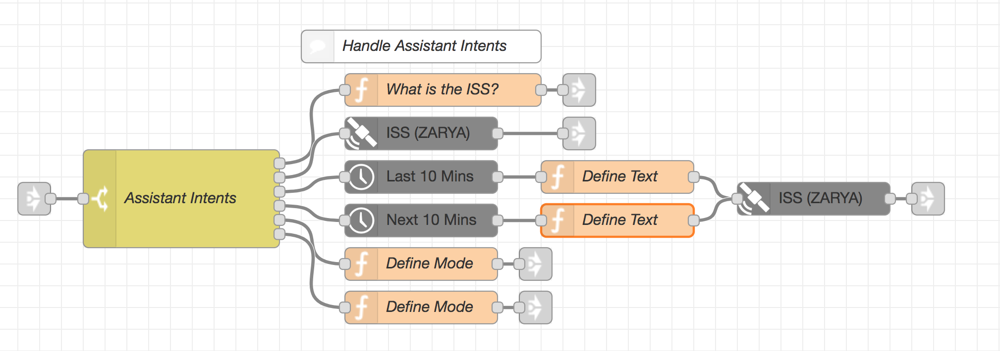

* Grab the following Nodes and connect them:

```
link node
switch node

in parallel:
function node
satellite node
time array
time array
function
function

from each time array:
function

from both functions:
satellite

link node
```

* Open up the switch node, name it `Assistant Intents`, and add the property `assistant.intents[0].intent` (after `msg.`).
We'll have a total of 6 intents, so use the `+add` button to add 5 more. Name them: `what`,`where`,`where-historical`,`where-future`, `mode-2d`, and `mode-3d`.

* Open the top function node, name it `Where is the ISS?`, and paste the [whatIsTheISS.js](../data/NodeRED/Functions/whatIsTheISS.js) code.

* The satellite node should already have Sat. Type `Space Stations` and Satellite `ISS(ZARYA)`.

* Open the top Satellite Time Array node and configure with `+/-` `10` mins, Samples `20`, and Name `Last 10 mins`.

* Open the second Satellite Time Array node and configure with `+/-` `0` mins, Samples `20`, and Name `Next 10 mins`.

* Open the next function node, name it `Define Mode` and paste the [defineMode.js](../data/NodeRED/Functions/defineMode.js) code.

* Open the bottom function node, name it `Define Mode` and paste the [defineMode.js](../data/NodeRED/Functions/defineMode.js) code. Change the code from `2d` to `3d`.

* The 2 functions coming after the Satellite Time array should both be named `Define Text`. Paste the [defineText.js](../data/NodeRED/Functions/defineText.js) code in each and change the bottom one from `Last` to `Next`.

* The final Satellite node should be the same as the first, with Satellite `ISS(ZARYA)`.

### Create the HTML Chat UI

* In your Node-RED flow editor, drag-and-drop nodes for `HTTP input`, `template`, and `HTTP response` and wire them together.

* Double-click the first node `http in` and change the Method to `GET` and the URL to `/bot`. Name it `Chat home page`.

* Add the [chat-ui.html](../data/NodeRED/HTML/chat-ui.html) code to the template node and name it `HTML`.

* Name the http response node `Chat http response`.

### Create the World Map UI

* In the Node-RED flow editor, drag-and-drop 2 `link` nodes, an `inject` node, 4 `function` nodes, a `worldmap` node, an `earth` node,  and a `worldmap-tracks` node.

* Wire them up:

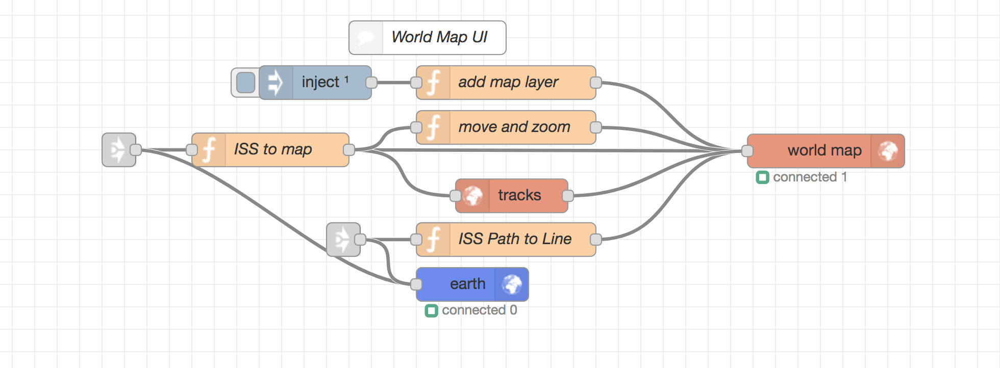

* Double-click the `inject` node and tick the checkbox for ` Inject once after 0.1 seconds.

* Double-click the top function node (after the timestamp) and add the code for [add map layer](../data/NodeRED/Functions/addMapLayer.js). Name it `add map layer`.

* Double-click the function node after the link node and add the code for [ISS to Map](../data/NodeRED/Functions/ISStoMap.js). Name it `ISS to map`.

* Double-click the function node after `ISS to map`, and add the code for [move and zoom](..data/NodeRED/Functions/moveAndZoom.js). Name it `move and zoom`.

* Double-click the last function node, between `tracks` and `earth`, name it `ISS Path to Line` and paste the code [ISSPathToLine.js](..data/NodeRED/Functions/ISSPathToLine.js).

* The `worldmap`, `tracks`, and `earth` nodes do not need any configuring.

### Connect the Link nodes

The Link nodes are named for the nodes that are connected to, with either `IN` or `OUT` appended to indicate whether they go in to or out from that node.
You connect the link nodes by double-clicking and choosing the node they connect to . For example, we connect `Generate Timestamp OUT` to `Assistant Intents IN`:

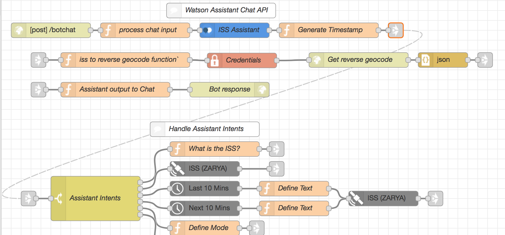

  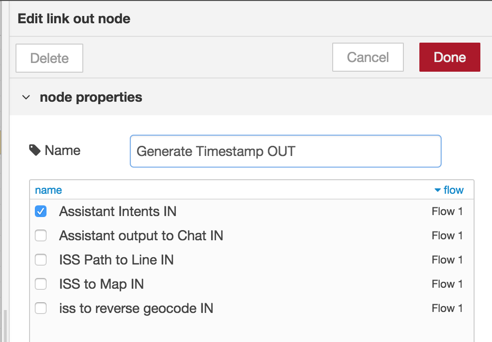
  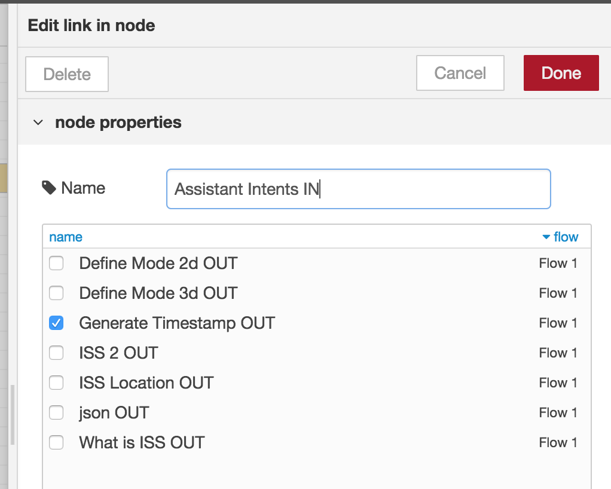

* Connect `iss to reverse geocode IN` to `ISS Location OUT`:

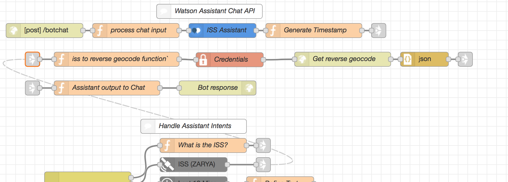

* Connect `json OUT` to `Assistant output to Chat IN`:

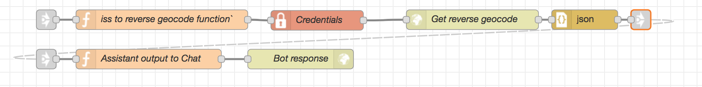

*  Connect `What is ISS OUT`, `ISS 2 OUT`, `Define Mode 2d OUT`, and `Define Mode 3d OUT` to `Assistant output to Chat IN`:

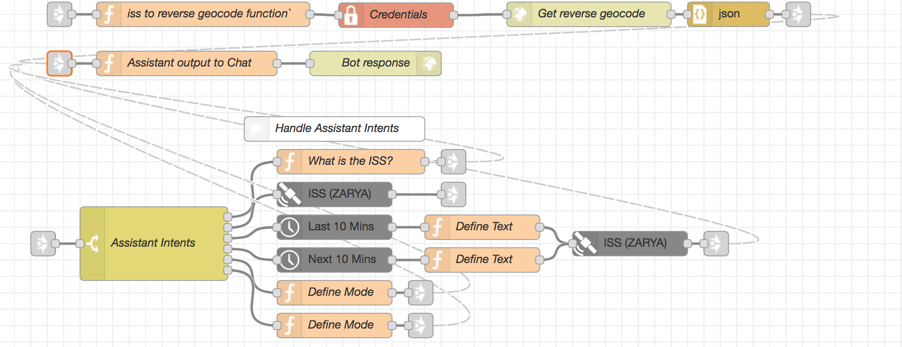

* Connect `ISS Location OUT` to both `ss to reverse geocode IN` and `ISS to Map IN`:

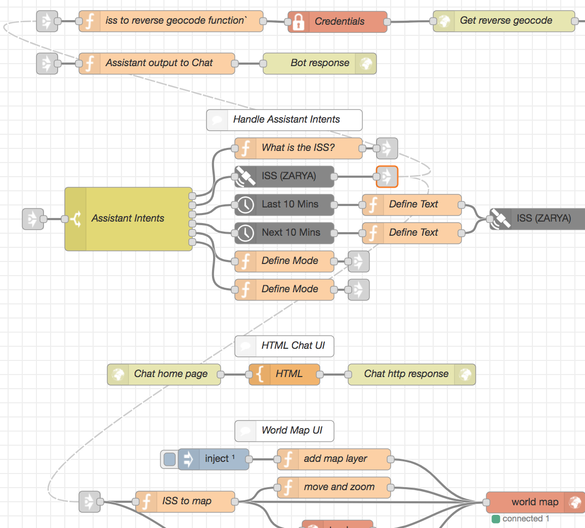

* Connect `ISS 2 OUT` to `ISS to Map IN` and `ISS Path to Line IN` (It's already connected to `Assistant output to Chat IN`):

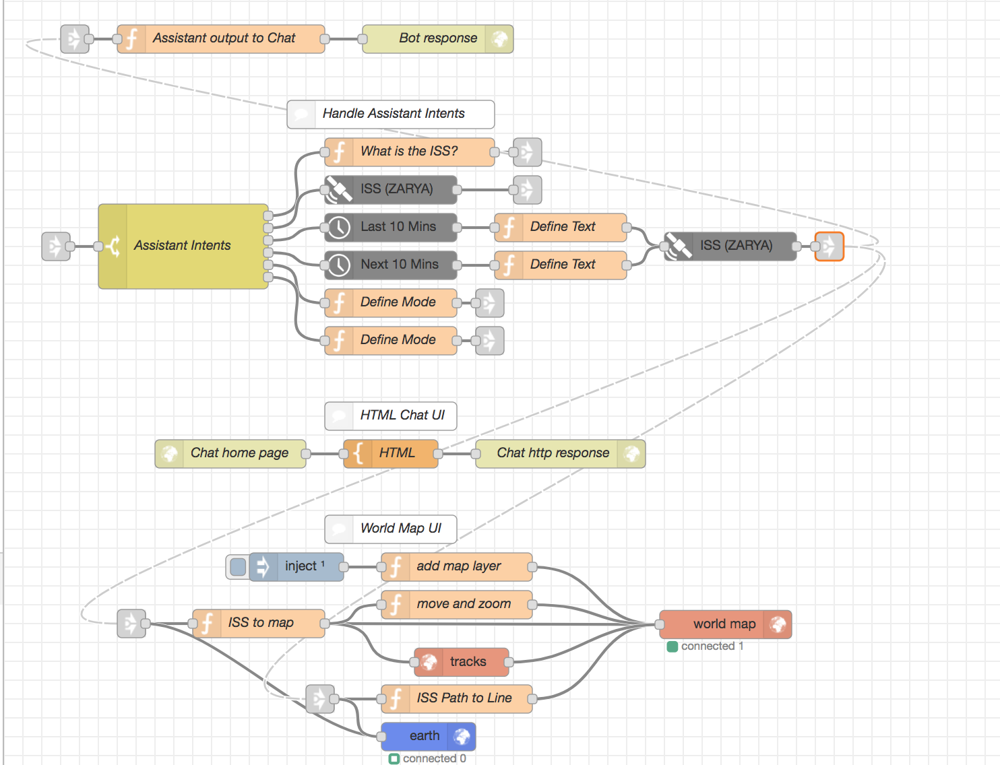

### Deploy the App

Click `Deploy`

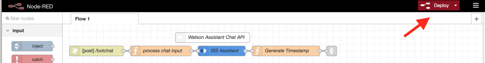
